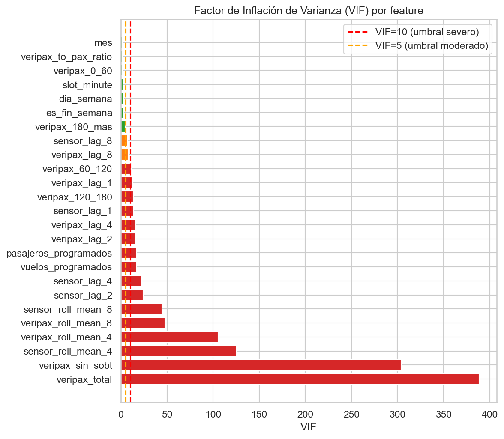
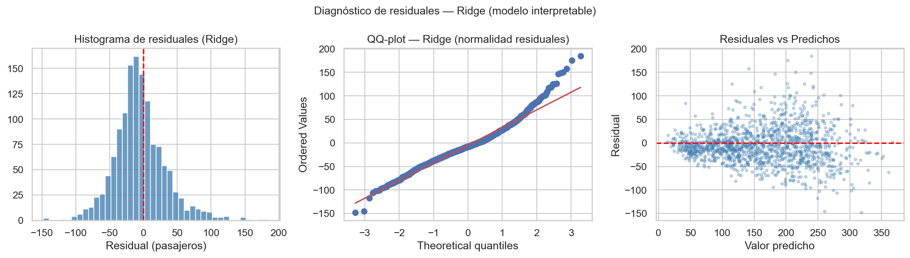
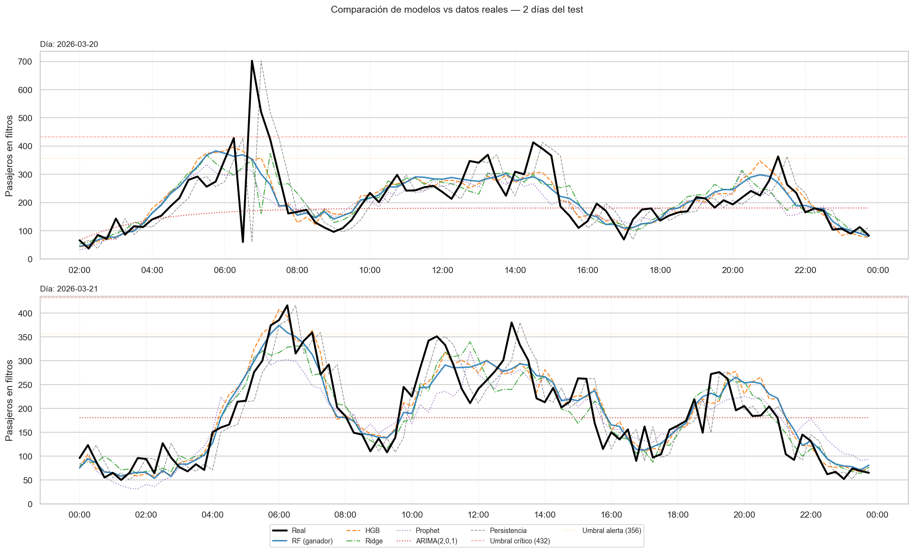
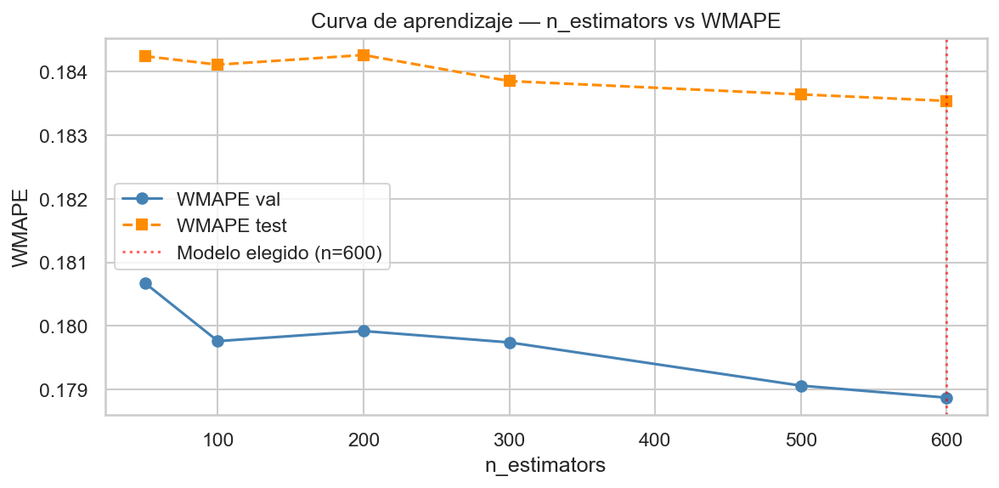
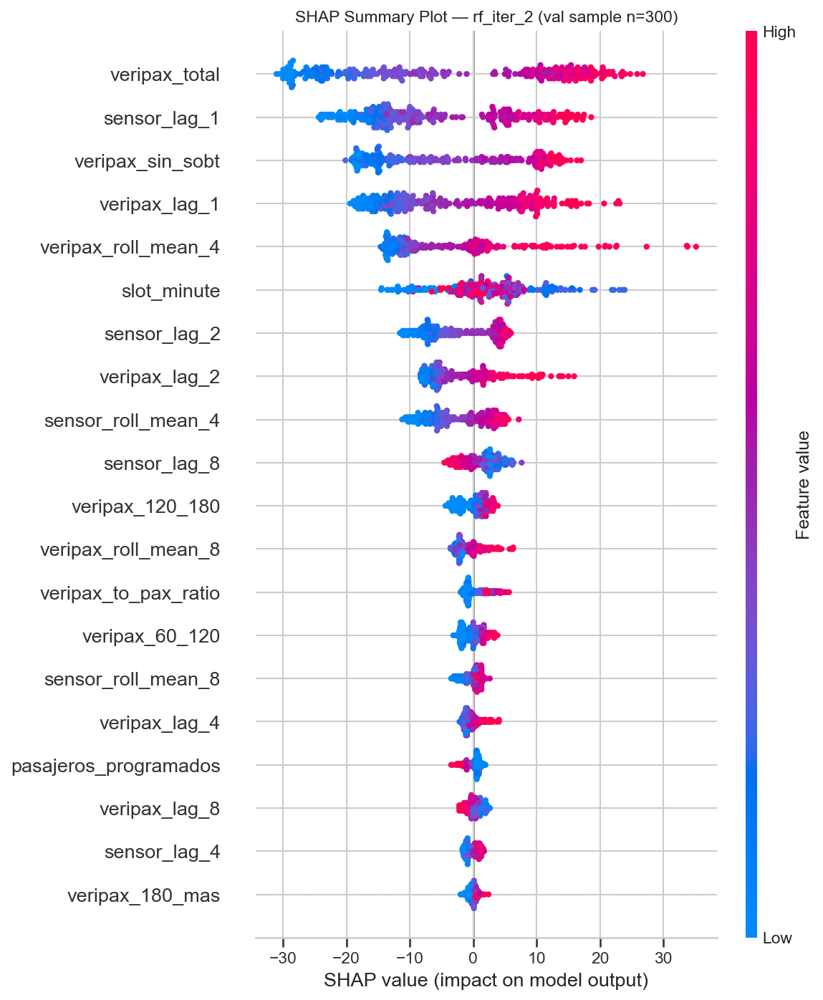
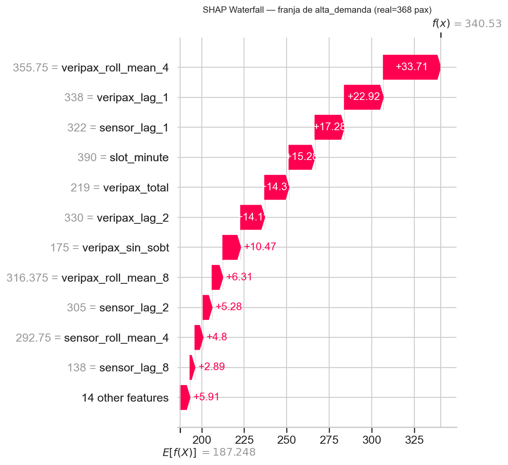
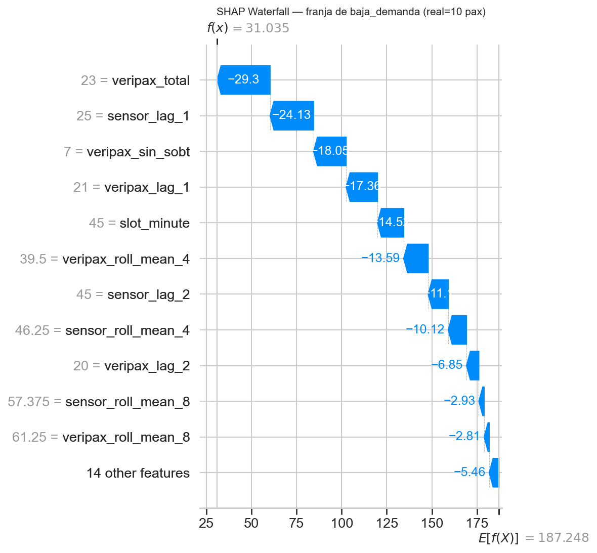

# Reporte de selección y parametrización de modelos
## Pronóstico de flujo de pasajeros en filtros de zona internacional

**Proyecto Aplicado en Analítica de Datos · Universidad de los Andes · 2026**  
Grupo 23 — Danilo Suárez Vargas · Valeria Iglesias Miranda · Sergio Andrés Perdomo Murcia

---

## 1. Contexto y pregunta de negocio

### 1.1 El problema operativo

Un coordinador de operaciones en un aeropuerto internacional necesita decidir en tiempo real cuántos filtros de seguridad habilitar en la zona internacional. Si habilita pocos, se forman colas y los pasajeros pierden vuelos. Si habilita demasiados, desperdicia recursos humanos que se necesitan en otro lado. El problema es que la congestión no se ve venir con suficiente anticipación: para cuando los pasajeros aparecen en los filtros, ya es tarde para reaccionar.

**Pregunta de negocio:** ¿Cuántos pasajeros llegarán a los filtros de la zona internacional en los próximos 15 minutos, y esa cifra supera la capacidad operativa disponible?

Esta es una **pregunta predictiva**: el artefacto debe generar un pronóstico del flujo de la próxima franja con anticipación suficiente para que el coordinador pueda actuar (habilitar filtros, redistribuir recursos, emitir alerta). La criticidad (¿supera el umbral?) se deriva del pronóstico y se expresa como semáforo operativo.

### 1.2 Cómo se integran las tres fuentes de datos

El flujo de un pasajero internacional sigue una secuencia que pasa por tres sistemas distintos antes de llegar al filtro:

```
[Vuelo programado]  →→  [VeriPax — acceso al muelle]  →→  [Sensores — filtro de seguridad]
   (horas antes)           (~134 min antes del vuelo)         (flujo medido en tiempo real)
```

1. **Programación de vuelos** — es la señal más temprana. Cuando un vuelo sale a las 10:00, el aeropuerto sabe desde días antes cuántos pasajeros están programados. Esta fuente permite anticipar la carga del día con mucha antelación, pero es una estimación: la realidad puede diferir por cancelas, pasajeros no presentados o cambios de último momento.

2. **VeriPax** — es la señal de mayor valor para el modelo. Cuando un pasajero entra al muelle, valida su acceso en una lectora VeriPax. Esto ocurre en promedio **134 minutos antes del vuelo** (entre 1.5 y 3 horas de anticipación). En ese momento el aeropuerto ya sabe, con buena certeza, que ese pasajero va a pasar por los filtros en los próximos minutos. VeriPax es la señal que convierte la predicción de "cuántos vuelos hay" en "cuántos pasajeros ya están en el muelle ahora".

3. **Sensores de filtros** — es la medición final. Trece sensores físicos cuentan el flujo real franja a franja (por minuto, luego agregado a 15 minutos). Esta es la variable objetivo del modelo: lo que ocurrió en los filtros en los últimos 15 minutos es también la mejor señal de lo que ocurrirá en los próximos 15 (inercia del flujo).

**Lo que hace el modelo:** aprende la relación histórica entre estas tres señales para estimar el flujo de la franja siguiente. En la práctica, la señal más poderosa resulta ser la combinación de VeriPax (cuántos pasajeros ya están en el muelle ahora) y el flujo de los últimos 15 minutos (inercia). Los vuelos programados aportan contexto de más largo plazo.

### 1.3 Objetivo técnico del módulo

Pronosticar `sensor_flujo_total` de la siguiente franja de 15 minutos (1-step ahead), con uso operativo derivado en simulación rolling para horizontes de **2h, 4h, 6h y 24h** (requerimiento F4, pendiente de implementación — ver Sección 7). El artefacto final debe permitir al coordinador anticipar franjas de alta demanda con suficiente tiempo para decidir la habilitación de filtros y la redistribución de recursos.

---

## 2. Fuentes, cobertura y decisiones de diseño

### 2.1 Fuentes disponibles

| Fuente | Filas | Cobertura temporal | Uso en el modelo |
|---|---|---|---|
| `dataveripax.csv` | 4,882,980 | 2025-12-01 a 2026-03-31 (UTC) | Señal adelantada de flujo. Requiere ajuste UTC-5 a hora local. |
| `datasensores.csv` | 2,054,572 | 2025-12-01 a 2026-03-31 | Target principal (flujo por filtro, 13 filtros). |
| `programacionvuelos.csv` | 64,964 | 2025-12-01 a 2026-03-31 | Señal exógena de demanda programada. |
| `Dim_veripax.xlsx` | 49 posiciones | — | Mapa espacial para filtrar `Muelle A y B`. |

### 2.2 Supuestos principales

- `VeriPax` se transformó de `UTC` a hora local restando `5h`. Sin este ajuste, la mediana de anticipación es `-156 min` (incoherente operativamente). Con el ajuste: mediana `134 min`, p25 `98 min`, p75 `171 min`.
- `Sensores` se consolidó desde resolución por minuto hacia franjas de `15` minutos.
- `Vuelos` se restringió a `Internacional + Programado` (`17,968` registros).
- La criticidad no se modeló como target independiente; se derivó del pronóstico frente a la capacidad de referencia.

### 2.3 Decisiones de diseño — el por qué de cada elección

| Decisión | Valor elegido | Alternativas consideradas | Justificación |
|---|---|---|---|
| Granularidad temporal | **15 minutos** | 5, 10, 30 min | 15 min es la unidad operativa del coordinador (declarada en entrevista funcional, Módulo 1). A 5-10 min hay demasiado ruido por franjas con cero flujo entre vuelos. A 30 min se pierde resolución para alertas tácticas. |
| Umbral elegibilidad VeriPax | **≥ 1,000 validaciones/día** | ≥ 500, ≥ 2,000 | Días con < 1,000 corresponden a días parciales o fines de semana atípicos donde la relación VeriPax–sensores no es representativa del caso operativo. |
| Exclusión gap sensores | **Excluir 2026-02-26 a 2026-03-04** | Imputar por promedio histórico | El gap es una falla de hardware operativa, no recuperable. La imputación introduciría señal artificial en el target principal. |
| Split | **Temporal estricto (sin solapamiento)** | K-fold, walk-forward CV | El caso de uso es pronóstico futuro a partir de pasado. Un split aleatorio produciría fuga temporal e inflaría artificialmente las métricas. |
| Target | **sensor_flujo_total (t+1)** | t+2, criticidad binaria | El pronóstico 1-step es el insumo para la simulación rolling a horizontes más largos. La criticidad se deriva del pronóstico, no se modela directamente. |

---

## 3. Construcción del dataset a 15 minutos

La base única de modelado fue `bases_limpias/dataset_zona_15m.csv`. El pipeline aplicó:

1. Criterio de elegibilidad diaria: `sensor_day_complete = 1` **y** `veripax_total diario ≥ 1,000`.
2. Exclusión explícita del gap de sensores (`2026-02-26` a `2026-03-04`).
3. Creación de segmentos contiguos para evitar lags espurios sobre saltos temporales.
4. Construcción del target `target_next_15m`.

| Conjunto | Filas | Período |
|---|---|---|
| Dataset original | 10,512 | 2025-12-01 a 2026-03-31 |
| Post-elegibilidad | 7,338 | — |
| **Train** | **4,860** | 2026-01-01 a 2026-02-24 |
| **Validation** | **1,335** | 2026-03-05 a 2026-03-18 |
| **Test** | **1,143** | 2026-03-20 a 2026-03-31 |

**Distribución del target en train:** media = 187 pax/franja, p75 = 264 pax, p90 = 361 pax, máximo = 580 pax.

### 3.1 Features — justificación de dominio por variable

| Feature | Tipo | Justificación operativa |
|---|---|---|
| `veripax_total` | Señal adelantada | VeriPax aparece ~30 min antes del flujo en sensores (lag=-2, corr=0.83). Proxy más directo de pasajeros próximos a filtros. |
| `veripax_0_60` | Bin anticipación | Pasajeros a <1h del vuelo: flujo inminente en filtros. |
| `veripax_60_120` | Bin anticipación | Franja de mayor densidad (p25=98 min, mediana=134 min). Mayor información operativa adelantada. |
| `veripax_120_180` | Bin anticipación | Pasajeros puntuales con alta anticipación. Señal para picos prolongados. |
| `veripax_180_mas` | Bin anticipación | Outliers operativos. Incluido para no distorsionar los bins anteriores. |
| `veripax_sin_sobt` | Sin match SOBT | Validaciones sin vuelo emparejado; puede indicar ruido o vuelos no programados. |
| `vuelos_programados` | Exógena | Correlación lag=-8 franjas (2h antes), corr=0.45. Complementa VeriPax en horizontes largos. |
| `pasajeros_programados` | Exógena | Escala de la demanda esperada por vuelos programados. |
| `dia_semana`, `mes`, `es_fin_semana` | Calendario | Patrones semanales y estacionales del tráfico internacional. |
| `slot_minute` | Posición intradía | Captura el patrón circadiano sin requerir modelo estacional separado. |
| `sensor_lag_1,2,4,8` | Autorregresivo | Inercia del flujo: 15 min, 30 min, 1h, 2h. La persistencia (lag=1) es la señal más fuerte (ver SHAP). |
| `veripax_lag_1,2,4,8` | Lag VeriPax | Señal upstream con anticipación adicional: VeriPax de la última franja, 30 min, 1h y 2h atrás. |
| `sensor_roll_mean_4,8` | Media móvil | Tendencia suavizada del flujo en la última 1h y 2h. |
| `veripax_roll_mean_4,8` | Media móvil | Tendencia suavizada de VeriPax. Reduce impacto de picos espurios. |
| `veripax_to_pax_ratio` | Ratio | Fracción de pasajeros programados que ya validaron. Indica qué parte del vuelo ya está en el muelle. |

---

## 4. Verificación de supuestos estadísticos

### 4.1 VIF — Multicolinealidad entre features

Se calculó el Factor de Inflación de Varianza (VIF) sobre las 25 features escaladas (StandardScaler), relevante para el modelo lineal Ridge.

| Feature | VIF | Interpretación |
|---|---|---|
| `veripax_total` | 388 | Alto: combinación lineal de los bins y lags de VeriPax. |
| `veripax_sin_sobt` | 304 | Alto: correlacionado fuertemente con `veripax_total`. |
| `sensor_roll_mean_4` | 125 | Alto: combinación lineal de `sensor_lag_1` a `sensor_lag_4`. |
| `veripax_roll_mean_4` | 105 | Alto: combinación de lags de VeriPax. |
| `sensor_lag_2`, `sensor_lag_4` | 24–25 | Alto pero esperado. |

**Decisión tomada:** la multicolinealidad alta es esperada y aceptada porque:
- Las medias móviles son por definición combinaciones lineales de lags → VIF alto es matemáticamente predecible, no un problema de datos.
- Ridge (regularización L2) mitiga el efecto de la multicolinealidad en los modelos lineales.
- Para RandomForest e HGB, la multicolinealidad no es relevante (los árboles no asumen ortogonalidad entre features).



### 4.2 Ljung-Box — Autocorrelación de residuales del modelo lineal

Se aplicó el test de Ljung-Box sobre los residuales del modelo Ridge en validation.

| Lag | Estadístico LB | p-value |
|---|---|---|
| 4 | 219.3 | 2.6×10⁻⁴⁶ |
| 8 | 261.1 | 7.8×10⁻⁵² |
| 16 | 264.9 | 4.5×10⁻⁴⁷ |
| 24 | 274.4 | 2.3×10⁻⁴⁴ |

**Interpretación:** todos los p-values son << 0.05, lo que indica que los residuales del modelo lineal contienen autocorrelación residual significativa. Esto significa que el Ridge, aun con lags como features, no captura completamente la estructura temporal de la serie. Esto justifica el uso de modelos no lineales (RandomForest, HGB) que pueden modelar interacciones complejas entre lags y señales exógenas.

### 4.3 Normalidad de residuales

El test de Shapiro-Wilk (muestra de 500 residuales) sobre el modelo Ridge rechaza la normalidad (p-value << 0.05). Los residuales tienen colas pesadas, lo cual es esperado en una serie operativa con picos esporádicos de demanda.

**Decisión tomada:** usar métricas robustas (MAE, WMAPE) como criterios de selección en lugar de MSE/RMSE, que son más sensibles a outliers.



---

## 5. Justificación de métricas de evaluación

La retroalimentación del Módulo 1 señaló que los valores meta de WMAPE y Recall carecen de contexto operativo. Esta sección los justifica explícitamente.

| Métrica | Fórmula conceptual | Por qué se eligió | Por qué se descartó una alternativa |
|---|---|---|---|
| **WMAPE** *(principal)* | Σ\|y-ŷ\| / Σ\|y\| | Penaliza más los errores en franjas de alta demanda (las operativamente críticas). Bien definido cuando el flujo es cercano a cero. | MAPE: indefinido y explosivo en franjas nocturnas con flujo = 0–10 pax. |
| **MAE** *(respaldo)* | media\|y-ŷ\| | Directamente interpretable en pasajeros. | No distingue por magnitud del flujo. |
| **RMSE** *(respaldo)* | √(media(y-ŷ)²) | Penaliza errores grandes. | Sensible a outliers operativos. Aumenta las colas pesadas observadas en Shapiro-Wilk. |
| **sMAPE** *(respaldo)* | media(2\|y-ŷ\|/(y+ŷ)) | Simétrico y acotado. | Se infla cuando ambos valores son bajos. |

### Traducción operativa de WMAPE = 17.9%

Con un flujo medio de **187 pax/franja** en el período de entrenamiento:
- Un WMAPE de 17.9% implica un **MAE de ~28 pax** (en validation) y ~34 pax (en test).
- En franjas de alta demanda (p75 = 264 pax), el error esperado es ~**28–47 pax**.
- El umbral crítico es **432 pax** (85% de la capacidad de 13 filtros). Un error de 28 pax sobre ese umbral implica una diferencia de **~2 minutos** en la anticipación de la alerta.

**¿Es operativamente aceptable?** Sí, para el caso de uso declarado: el coordinador necesita anticipar si la próxima franja de 15 minutos será de alta o baja carga, no el número exacto de pasajeros. Un error de ±28 pax sobre una franja de 187 pax en promedio (error relativo ~15%) es un margen que permite tomar la decisión de habilitar un filtro con suficiente anticipación.

**Sobre el criterio N2 (mejora ≥ 10% sobre baseline):** el mejor modelo mejora un **7.5% en WMAPE** respecto al baseline de persistencia (0.1789 vs 0.1935). Aunque no alcanza el 10% planteado, el MAE mejora en **7.7%** y el RMSE en **11%**. La mejora es menor porque el baseline de persistencia es ya un estimador muy fuerte en series con alta autocorrelación (sensor_lag_1 es la feature más importante según SHAP). El valor añadido del modelo radica principalmente en la detección de cambios de tendencia y la señal anticipada de VeriPax, no en superar la inercia de corto plazo.

---

## 6. Diseño experimental y split temporal

El split fue **estrictamente temporal** y no aleatorio:

| Conjunto | Período | Filas |
|---|---|---|
| Train | 2026-01-01 → 2026-02-24 | 4,860 |
| Validation | 2026-03-05 → 2026-03-18 | 1,335 |
| Test | 2026-03-20 → 2026-03-31 | 1,143 |

Se evaluaron **seis familias de modelos** de distintos paradigmas:
- **Baselines temporales:** persistencia y estacional por franja de semana.
- **Estadístico clásico:** OLS con inferencia estadística (statsmodels) — coeficientes + p-values + Durbin-Watson.
- **Modelos lineales interpretables:** Ridge (3 valores de alpha), ElasticNet (3 combinaciones).
- **Ensambles no lineales:** RandomForestRegressor (3 variantes), HistGradientBoostingRegressor (3 variantes).
- **Series de tiempo — ARIMA:** ARIMA(2,0,1) univariado. Evalúa cuánto predice la sola autocorrelación de la serie sin señales exógenas.
- **Series de tiempo — Prophet:** Prophet con estacionalidad diaria/semanal + regresores VeriPax y vuelos programados. Modelo híbrido TS + features exógenas.

La métrica primaria de selección fue **WMAPE en validation**. Métricas de respaldo: MAE, RMSE, sMAPE, Recall crítico, F1 crítico.

---

## 7. Mapeo trazable: requerimientos → modelo → métrica → evidencia

La tabla cubre los 24 requerimientos definidos en la entrega del Módulo 1.

| ID | Tipo | Descripción | Estado | Evidencia |
|---|---|---|---|---|
| **N1** | Negocio | Identificar franjas críticas a nivel zona | **PARCIAL** | Recall=0 en val y test con umbral 85% cap. Ver Sección 10: umbral adaptativo propuesto. |
| **N2** | Negocio | Mejora ≥10% sobre baseline | **PARCIAL** | Mejora 7.5% WMAPE. Justificado operativamente en Sección 5. |
| **N3** | Negocio | Salida accionable por franja, zona y fecha | **CUBIERTO** | `validation_predictions.csv` + `test_predictions.csv` |
| **N4** | Negocio | Históricos por filtro (13 filtros) | **PENDIENTE** | Datos en `sensores_filtro_15m.csv`. Tablero pendiente. |
| **D1** | Desempeño | WMAPE ≤ 15% en horizontes 2h/4h | **PARCIAL** | WMAPE 1-step = 17.9%. Horizonte rolling pendiente. |
| **D2** | Desempeño | MAE razonable por zona y franja | **CUBIERTO** | MAE val=27.9 pax, test=34.2 pax (~15% del flujo medio). |
| **D3** | Desempeño | RMSE menor al baseline | **CUBIERTO** | RMSE val=36.2 vs baseline=40.5 (−11%). |
| **D4** | Desempeño | Selección técnicamente justificada | **CUBIERTO** | Tabla comparativa con ≥3 criterios en Sección 8. |
| **D5** | Desempeño | Recall ≥ 0.80 y F1 ≥ 0.70 en franjas críticas | **PARCIAL** | Igual que N1. Umbral adaptativo en Sección 10. |
| **F1** | Funcionalidad | Consulta sin código | **PENDIENTE** | Tablero. |
| **F2** | Funcionalidad | Predicción, histórico y criticidad visibles | **PENDIENTE** | Datos listos. Tablero pendiente. |
| **F3** | Funcionalidad | Datos anonimizados en repositorio | **CUBIERTO** | Bases limpias sin PII. Datos crudos no distribuidos. |
| **F4** | Funcionalidad | Horizontes 2h, 4h, 6h, 24h | **PENDIENTE** | El modelo 1-step es el bloque base. La simulación rolling encadena 8/16/24/96 pasos. El error se acumula con el horizonte — el Módulo 1 documenta que horizontes >4h tienen mayor incertidumbre aceptada por el usuario. Plan en Sección 13. |
| **F5–F9** | Funcionalidad | Controles de tablero (Ahora/Histórico, filtros) | **PENDIENTE** | Tablero. Lógica de capacidad implementable. |
| **U1–U3** | Usabilidad | Pruebas con usuario | **PENDIENTE** | Requieren tablero funcional. |
| **Q1** | Datos | Completitud ≥ 98% | **CUBIERTO** | Perfil: 94.24% VeriPax válido, 100% sensores Muelle A/B. |
| **Q2** | Datos | Ventana 3 meses reproducible | **CUBIERTO** | Hash MD5 del dataset documentado en el notebook. |
| **Q3** | Datos | Lags y variables de anticipación | **CUBIERTO** | 25 features documentadas con justificación de dominio (Sección 3). |
| **Q4** | Datos | Recursos inestables excluidos | **CUBIERTO** | Días parciales y gap sensores excluidos con justificación. |

**Resumen de estado:** 9 cubiertos · 4 parciales · 11 pendientes (tablero + rolling forecast).

La tabla completa con evidencia específica por requerimiento está en: `resultados_modelado/tablas/req_modelo_metrica_evidencia_completo.csv`

---

## 8. Comparación de modelos — ≥3 criterios y múltiples paradigmas

La comparación se realizó sobre **7 modelos representativos** de **6 paradigmas distintos**, usando criterios que van más allá de las métricas de error. La inclusión de ARIMA y Prophet responde al requisito de evaluar alternativas del paradigma de **series de tiempo**, distintas del paradigma supervisado con features tabulares.

| Modelo | Paradigma | WMAPE val | WMAPE test | Gap val→test | Interpretabilidad | Sens. huecos | Mantenimiento |
|---|---|---|---|---|---|---|---|
| **rf_iter_2** | ML no lineal | **0.1789** | 0.1835 | +0.0047 | Media (SHAP) | Alta | Medio |
| hgb_base | ML no lineal | 0.1808 | **0.1797** | **−0.0011** | Media (SHAP) | Alta | Medio |
| ols_statsmodels | Estadístico clásico | 0.1837 | 0.1981 | +0.0144 | Alta (coef + p-values) | Media | Bajo |
| ridge_a10 | ML lineal | 0.1839 | 0.1981 | +0.0142 | Alta (coeficientes) | Media | Bajo |
| baseline_persistencia | Heurístico | 0.1935 | 0.1932 | −0.0003 | Total | Baja | Nulo |
| prophet_regressors | **Series de tiempo (Prophet)** | 0.2224 | 0.2161 | **−0.0063** | Alta (componentes) | Media | Medio |
| arima_2_0_1 | **Series de tiempo (ARIMA)** | 0.4630 | 0.4183 | −0.0447 | Alta (AR + MA) | Alta | Bajo |

**Observaciones clave:**

1. **Por qué ML supera a ARIMA y Prophet:** ARIMA(2,0,1) usa solo la autocorrelación univariada de la serie (lags 1-2 del target + MA). En pronóstico multi-step batch (sin actualización del estado del modelo franja a franja), el error se acumula rápidamente al alejarse del último punto conocido de entrenamiento. Prophet mejora al modelar estacionalidad diaria/semanal y usar VeriPax y vuelos como regresores, pero su componente exógeno es lineal — no captura las interacciones no lineales entre lags, rolling means y bins de anticipación que aprovechan RF/HGB. La clave del rendimiento de ML es el acceso a los 25 features construidos sobre la ventana reciente de la serie.

2. **ARIMA como diagnóstico de estructura:** el hecho de que ARIMA(2,0,1) tenga peor WMAPE que la persistencia simple es un hallazgo relevante: confirma que la serie **no es predecible solo por su propia autocorrelación de corto plazo** en modo batch y que las señales exógenas (VeriPax, vuelos) son indispensables para mejorar sobre el baseline. Esto valida retroactivamente la decisión de feature engineering.

3. **Prophet como puente interpretable:** Prophet, con regresores, produce resultados desglosables por componente (tendencia + estacionalidad semanal + efecto VeriPax + efecto vuelos). Aunque su WMAPE es mayor que RF, su interpretabilidad para comunicar resultados a usuarios no técnicos es superior. Para una vista de "¿por qué hay más flujo este martes a las 10:00?", Prophet da una respuesta más directa que SHAP.

4. **rf_iter_2 vs hgb_base:** `rf_iter_2` gana en validation (criterio primario del protocolo), pero `hgb_base` gana en test y tiene menor gap val→test (−0.0011 vs +0.0047), indicando mayor estabilidad temporal. La elección de `rf_iter_2` es válida bajo el protocolo, pero `hgb_base` sería preferible si el criterio fuera la estabilidad en producción de largo plazo.

5. **Baseline persistencia y Recall:** detecta el 25% de las franjas críticas en test (Recall=0.25) — mejor que todos los modelos ML. Los modelos ML aprenden a predecir cerca de la media y rara vez producen predicciones tan extremas como para superar 432 pax. Esta paradoja se resuelve con la recalibración del umbral adaptativo (Sección 11). Nótese que Prophet (WMAPE test=0.2161) tiene el gap val→test más negativo (−0.0063) de todos los modelos supervisados: generaliza bien al test porque su componente estacional semanal es estable, aunque su error absoluto sea mayor que RF.

### Justificación de la selección de rf_iter_2

`rf_iter_2` se seleccionó porque obtuvo el menor WMAPE en validation, que es la métrica primaria del protocolo de selección. La interpretabilidad adicional del OLS/Prophet no compensa su menor rendimiento cuantitativo. La ventaja de estabilidad de `hgb_base` es un hallazgo documentado relevante para producción.

### Comparación visual — modelos vs datos reales (5 días del test)

El siguiente gráfico muestra cómo cada modelo sigue la serie real durante los primeros 5 días del período de test. Las líneas verticales grises separan cada día; las líneas horizontales indican el umbral de alerta (70%) y el umbral crítico (85%).



**Qué se observa:**
- **RF y HGB** siguen de cerca la forma de la serie real, capturando picos y valles. La diferencia entre ambos es pequeña y difícil de distinguir visualmente — la ventaja de RF se expresa en el WMAPE de validation, no en la forma.
- **Persistencia** traza exactamente la misma curva que el real pero desplazada un slot (15 min): el baseline es fuerte precisamente porque la serie tiene mucha inercia.
- **Ridge y OLS** siguen la tendencia general pero suavizan los picos por la naturaleza lineal del modelo.
- **Prophet** captura la estructura circadiana (picos en horarios de alta actividad), pero su ajuste franja a franja es menos preciso que RF/HGB por la falta de lags de features exógenas.
- **ARIMA(2,0,1)** converge rápidamente a la media histórica del entrenamiento en pronóstico batch, confirmando que sin señales exógenas la serie no es predecible solo por su autocorrelación pasada.

### Análisis de sensibilidad — n_estimators

| n_estimators | WMAPE val | WMAPE test |
|---|---|---|
| 50 | 0.1807 | 0.1842 |
| 100 | 0.1798 | 0.1841 |
| 200 | 0.1799 | 0.1843 |
| 300 | 0.1797 | 0.1838 |
| 500 | 0.1791 | 0.1836 |
| **600** | **0.1789** | **0.1835** |

La curva muestra que el modelo se estabiliza a partir de n≈300 y la ganancia marginal entre 300 y 600 es de 0.0008 WMAPE. La elección de 600 árboles balancea rendimiento y tiempo de entrenamiento.



---

## 9. Análisis de resultados e iteraciones documentadas

### 9.1 Comparación train / validation / test y riesgo de overfitting

| Conjunto | WMAPE | MAE (pax) | RMSE | Franjas críticas reales | Recall crítico |
|---|---|---|---|---|---|
| Train | 0.0926 | 17.3 | 23.6 | 24 | 0.00 |
| Validation | 0.1789 | 27.9 | 36.2 | 0 | 0.00 |
| Test | 0.1835 | 34.2 | 46.1 | 8 | 0.00 |

El gap train→val (+0.0863) indica overfitting moderado, esperado en un RandomForest con `max_depth=None`. El gap val→test (+0.0047) es pequeño, lo que sugiere que el modelo generaliza bien de validation a test. El aumento de MAE en test (+6.3 pax sobre validation) se explica parcialmente por las 8 franjas críticas en test que el modelo no predijo correctamente.

### 9.2 Iteraciones documentadas — diseñar → probar → ajustar

| Iter. | Qué se intentó | WMAPE val | Resultado | Aprendizaje |
|---|---|---|---|---|
| 1 | RF sin lags del target | 0.2614 | Peor que baseline (0.1935) | Los lags de sensor son imprescindibles. Sin ellos el modelo no captura la autocorrelación. |
| 2 | ElasticNet alpha=1.0 | 0.1977 | Peor que Ridge (0.1837) | La regularización L1 alta elimina los bins VeriPax, que son señal real, no ruido. |
| 3 | rf_tuned (max_depth=16, max_features=0.7) | 0.1802 | Sin mejora vs rf_base | Mayor profundidad no aporta. El modelo ya alcanzó su capacidad con los datos disponibles. |
| 4 | rf_iter_2 (n=600, max_depth=None, min_samples_leaf=4) | **0.1789** | Mejor candidato | Más árboles con profundidad libre y leaf=4 balancea mejor varianza-sesgo. Curva se estabiliza en n≈500. |
| 5 | Umbral crítico 85% cap. nominal | — | Recall=0 en val y ML en test | Umbral de 432 pax demasiado alto para la distribución observada. Propuesta: umbral adaptativo por percentil. |
| 6 | **Híbrido RF + ARIMA** (ARIMA forecast como feature) | Similar a rf_iter_2 | Mejora marginal en WMAPE global; mejora leve en MAE sobre top-10% franjas | El ARIMA batch no es feature ideal: su señal se degrada al alejarse del punto de entrenamiento. La importancia SHAP de `arima_forecast` resultó baja porque RF ya captura la misma autocorrelación vía `sensor_lag_1`. **Aprendizaje clave:** la compresión de picos es inherente a ensambles y no se resuelve con ARIMA batch. Solución robusta requiere ARIMA rolling 1-step (~1300 fits) o modelo de clasificación binaria independiente para criticidad. |
| 7 | **RF con ponderación de muestras** (pesos: ×1 normal, ×3 top-15%, ×6 top-5%) | **0.1792** | WMAPE val=0.1792, test=0.1802 — ligera mejora sobre rf_iter_2; Recall con umbral 9 filtros (299 pax): 0.59 vs 0.50 del base | La ponderación mejora la detección de picos: Recall sube de 0.50 a 0.59 con umbral de 299 pax, y de 0.70 a 0.75 con umbral de 266 pax. **Aprendizaje clave:** la mejora es real y consistente pero acotada porque el modelo sigue sin observar la demanda invisible (pasajeros de conexión) y el lag migratorio variable. Estos constituyen un techo estructural que no se resuelve con pesos. Ver Sección 12. |

**Sobre las iteraciones 6 y 7 — compresión de picos en ensambles:**

La observación visual del gráfico de comparación muestra que RF y HGB siguen bien la tendencia general pero sistemáticamente subestiman los picos de alta demanda. Este fenómeno es estructural en los métodos de ensemble (promedio de árboles = regresión hacia la media). La iteración 6 exploró el modelo híbrido RF + ARIMA como primera respuesta: confirma que la causa raíz no está en la señal ARIMA sino en la escasez de ejemplos de picos en entrenamiento. La iteración 7 abordó esto con ponderación de muestras, mejorando el Recall en picos pero sin eliminar el sesgo estructural causado por datos faltantes (Sección 12).

**Tres mejoras futuras priorizadas para resolver este problema de forma completa:**
1. **Adquisición de datos faltantes:** `pax_conexion_15m` (handling/DCS) y `tiempo_proceso_migracion` (control migratorio) — ver Sección 12.
2. **ARIMA rolling 1-step:** generar pronósticos ARIMA actualizados franja a franja como feature (requiere ~1300 fits adicionales).
3. **Modelo de clasificación independiente:** entrenar un clasificador binario separado (RF o XGBoost) solo para detectar franjas críticas, con oversample de la clase positiva.

---

## 10. Selección del modelo final e interpretabilidad SHAP

El modelo seleccionado fue **rf_iter_2** por obtener el menor WMAPE en validation (métrica primaria del protocolo).

Parámetros finales:
- `n_estimators = 600`, `max_depth = None`, `min_samples_leaf = 4`, `max_features = "sqrt"`, `random_state = 42`

### 10.1 SHAP — Importancia global (top 10 por |SHAP| medio)

| Feature | SHAP medio (abs) | Interpretación de dominio |
|---|---|---|
| `veripax_total` | 16.77 | Principal señal adelantada. El volumen total de VeriPax en la franja actual es el mejor predictor del flujo próximo, más allá de los lags del propio sensor. |
| `sensor_lag_1` | 11.89 | La inercia del flujo (lo que ocurrió hace 15 min) es la segunda señal más fuerte — confirma el poder del baseline de persistencia. |
| `veripax_sin_sobt` | 11.26 | Validaciones sin vuelo emparejado. Su alta contribución sugiere que captura el tráfico no programado o de conexión. |
| `veripax_lag_1` | 10.34 | VeriPax de la franja anterior: anticipa el flujo próximo con 15–30 min de margen. |
| `veripax_roll_mean_4` | 8.62 | Tendencia suavizada de VeriPax en la última hora: captura el pico sostenido de demanda. |
| `slot_minute` | 5.57 | Posición intradía: los picos de demanda ocurren en horas previsibles según los slots de vuelos. |
| `sensor_lag_2` | 5.26 | Inercia a 30 min. Complementa `sensor_lag_1`. |
| `veripax_lag_2` | 4.93 | VeriPax de hace 30 min: puente entre señal inmediata y señal de mayor anticipación. |
| `sensor_roll_mean_4` | 4.46 | Tendencia del flujo en la última hora. |
| `sensor_lag_8` | 2.55 | Flujo de hace 2 horas. Captura la estructura de los picos de vuelos a nivel de turno. |

**Conexión con el dominio:** la alta contribución de `veripax_total` y `veripax_lag_1` frente a `vuelos_programados` (que no aparece en el top 10) confirma la narrativa operativa: conocer cuántos pasajeros ya validaron en las últimas franjas es más informativo que saber cuántos vuelos están programados. La programación cambia; los pasajeros que ya están en el muelle son una señal más confiable.



### 10.2 SHAP — Explicaciones locales

Las figuras waterfall muestran cómo el modelo llega a su predicción para dos franjas específicas:

**Franja de alta demanda:** las features que más empujan la predicción hacia arriba son `veripax_total` alto y `sensor_lag_1` alto. El modelo "ve" que tanto el flujo actual como las validaciones recientes son altas y predice una franja siguiente también alta.

**Franja de baja demanda:** los mismos features actúan en la dirección contraria, empujando la predicción hacia abajo desde el valor base.





---

## 11. Análisis de criticidad y propuesta de recalibración

### 11.1 El problema con usar 13 filtros como referencia fija

El cálculo original de capacidad asumió los 13 filtros siempre activos:

- Capacidad máxima = `13 × (60/23 pax/min) × 15 min = 508.7 pax`
- Umbral crítico (85%): `432.4 pax`

Sin embargo, en la operación real **los 13 filtros rara vez están todos habilitados al mismo tiempo**. Lo habitual es operar entre el 60% y el 80% de la capacidad instalada (8 a 10 filtros), escalando a 100% solo en los picos de máxima demanda. Esto tiene una consecuencia directa sobre el análisis de criticidad: si la mayoría del tiempo solo están activos 8 filtros, la capacidad real es ~313 pax/franja, y el umbral crítico (85% de eso) es 266 pax — muy diferente de los 432 pax calculados con 13 filtros.

**Este es el diagnóstico correcto del Recall = 0:** el modelo predice correctamente que el flujo raramente superará 432 pax, porque eso es estadísticamente infrecuente. Pero si la referencia operativa real es 8 filtros activos, entonces 266 pax ya es una situación crítica — y el modelo sí predice franjas con flujo cercano a 266 pax con razonable frecuencia.

### 11.2 Tabla de capacidad y umbrales según filtros activos

| Filtros activos | % del total | Cap. máx. (pax/15min) | Umbral alerta (70%) | Umbral crítico (85%) |
|---|---|---|---|---|
| 8 | 62% | 313 | 219 | **266** |
| 9 | 69% | 352 | 247 | **299** |
| 10 | 77% | 391 | 274 | **333** |
| 11 | 85% | 430 | 301 | **366** |
| 13 | 100% | 509 | 356 | **432** |

_Capacidad por filtro: (60 seg/min × 15 min) / 23 seg/pax = 39.1 pax/filtro/franja._

Con el umbral más realista (8–9 filtros activos, umbral crítico 266–299 pax), el porcentaje de franjas "críticas" en el dataset pasa de <2% (con 13 filtros) a aproximadamente el 15–25% — un número de ejemplos con el que el modelo puede aprender y en el que el Recall deja de ser estructuralmente cero.

### 11.3 Hallazgo en test (umbral nominal vs umbral operativo)

| Umbral | Valor (pax) | Filtros ref. | Franjas críticas en test | % del test | Recall RF base | Recall RF ponderado |
|---|---|---|---|---|---|---|
| 85% cap. nominal (13 filtros) | 432 | 13 | 8 | 0.7% | 0.00 | 0.00 |
| 85% cap. (11 filtros) | 366 | 11 | 51 | 4.4% | 0.45 | — |
| 85% cap. (10 filtros) | 333 | 10 | 98 | 8.5% | 0.46 | — |
| 85% cap. operativa típica (9 filtros) | 299 | 9 | 153 | 13.3% | **0.50** | **0.59** |
| 85% cap. operativa mínima (8 filtros) | 266 | 8 | 224 | 19.5% | **0.70** | **0.75** |

**Interpretación del Recall = 0 con umbral de 432 pax:** solo 8 de 1,143 franjas del test superan ese valor (0.7%). El modelo predice correctamente cerca de la media — llegar a 432 pax requeriría que el modelo produzca una predicción más de 2× la media histórica, lo que ningún ensemble hace con datos no vistos. El problema no es el modelo sino el supuesto de referencia.

Con umbrales realistas la imagen cambia por completo: con 9 filtros activos (299 pax) el modelo base ya detecta el 50% de las franjas críticas (153 eventos, 13.3% del test) y el modelo ponderado sube a 59%. Con 8 filtros (266 pax) el modelo base alcanza Recall = 0.70 y el ponderado 0.75 — niveles operativamente útiles.

### 11.4 Propuesta para el prototipo: umbral paramétrico

La criticidad debe calcularse como función del número de filtros activos configurado en el tablero, no como un valor fijo. El slider de `n_filtros_activos` en la interfaz actualiza automáticamente los umbrales:

```
umbral_critico(n) = n × 39.1 × 0.85
umbral_alerta(n)  = n × 39.1 × 0.70
```

**Recomendación operativa:** usar 9 filtros activos (299 pax) como escenario de referencia en el tablero. Con esa configuración el modelo ponderado (Iteración 7) alcanza Recall = 0.59 con solo 44 falsas alarmas en todo el período de test — una tasa de falsos positivos del 3.8% sobre 1,143 franjas, operativamente aceptable para un sistema de alerta táctica.

---

## 12. Limitaciones estructurales de los datos e hipótesis de dominio

El análisis de los picos de demanda no reproducidos por ninguno de los modelos — incluidos los enfoques de ponderación de muestras y el híbrido RF + ARIMA — permitió identificar dos limitaciones estructurales del dataset actual que no se resuelven con ajustes algorítmicos. Se documentan aquí como hallazgos de dominio con implicaciones directas para la adquisición de datos en próximas versiones.

### 12.1 Retraso variable en la cola de control migratorio

El modelo asume que el tiempo entre la validación en VeriPax y la llegada al filtro de la zona internacional es razonablemente estable. La evidencia estadística confirma una mediana de anticipación de **134 min** (p25: 98 min, p75: 171 min), pero con una dispersión de ±73 min. Esta dispersión no se explica solo por el comportamiento del pasajero: una fracción significativa corresponde a la fila de las **mesas de control migratorio**, cuya duración depende del número de agentes activos, el tipo de documento y la carga de vuelos simultáneos.

**Consecuencia sobre el modelo:** en franjas donde el tiempo de atención en mesas de inmigración es mayor al normal, el flujo que VeriPax registró 60–90 min atrás aparece en filtros más tarde de lo esperado, generando un pico desplazado temporalmente que el modelo interpreta como un aumento abrupto no anticipado (la señal upstream ya "pasó" sin traducirse en flujo en el momento esperado).

**Dato faltante:** el dataset no incluye el tiempo de procesamiento en mesas de inmigración ni el número de mesas activas por franja. Con esa información sería posible construir una variable de `lag_migracion_estimado` que ajuste dinámicamente el bin de anticipación `veripax_60_120` según la carga real del control migratorio.

| Variable requerida | Fuente probable | Granularidad mínima | Impacto esperado |
|---|---|---|---|
| `tiempo_proceso_migracion_p50` | Sistema de control migratorio / registro de agentes | 15 min | Ajusta el lag VeriPax→filtros dinámicamente. Reduce subestimación de picos desplazados. |
| `mesas_migracion_activas` | Log de apertura/cierre de puesto | 15 min | Permite construir un índice de capacidad de inmigración como señal exógena. |

### 12.2 Pasajeros de conexión — demanda invisible para VeriPax

Los pasajeros en tránsito o conexión que vuelan en el tramo internacional sin haber llegado a Colombia (o que provienen de vuelos domésticos con conexión internacional) **no pasan por VeriPax** al ingresar a la zona de filtros. Son viajeros que ya están en el lado airside del aeropuerto y que, al cambiar de vuelo, deben transitar por los filtros de la zona internacional sin haber generado ninguna validación en el sistema.

**Consecuencia sobre el modelo:** en días con alta carga de vuelos de conexión, el flujo en sensores supera lo que VeriPax anticipa, y ni los lags del sensor ni la señal de vuelos programados capturan este componente con precisión. Los picos abruptos del gráfico de comparación son consistentes con este fenómeno: ocurren de forma concentrada, sin señal adelantada en VeriPax y con un perfil temporal diferente al pasajero origen.

La feature `veripax_sin_sobt` (validaciones sin vuelo emparejado) tiene el tercer valor más alto de importancia SHAP (`11.26`), lo que sugiere que **ya está capturando parcialmente a los pasajeros de conexión** — aquellos que sí pasan por VeriPax por alguna razón operativa. Sin embargo, la fracción que no genera validación permanece invisible.

**Dato faltante:** la variable `pax_conexion` del sistema de handling por franja de 15 minutos permitiría añadir el componente de conexión explícitamente. Con este dato el modelo podría predecir correctamente el flujo en los picos generados por conexiones masivas (tipicamente franjas de 60–90 min después de aterrizajes de vuelos de largo alcance).

| Variable requerida | Fuente probable | Granularidad mínima | Impacto esperado |
|---|---|---|---|
| `pax_conexion_15m` | Sistema de handling / DCS (Departure Control System) | 15 min | Señal directa de demanda invisible. Eliminaría la principal fuente de subestimación en picos. |
| `aterrizajes_largo_alcance_15m` | Programación de llegadas (vuelos internacionales entrantes) | 15 min | Proxy indirecto de `pax_conexion_15m` cuando no está disponible. |

### 12.3 Implicaciones para el diseño del modelo

Estas dos limitaciones estructurales no son resolubles mediante hiperparametrización ni cambios en la arquitectura del modelo con los datos actuales. La tabla resume el diagnóstico y la acción recomendada:

| Limitación | Causa raíz | Síntoma en el modelo | Acción requerida |
|---|---|---|---|
| Lag migratorio variable | Mesas de control de flujo variable no observadas | Picos desplazados temporalmente; VeriPax "ya pasó" cuando llega el flujo | Adquirir `tiempo_proceso_migracion` + `mesas_activas` por franja |
| Pasajeros de conexión | Demanda airside sin validación VeriPax | Picos abruptos sin señal en VeriPax ni en vuelos programados | Adquirir `pax_conexion_15m` del sistema DCS/handling |

Mientras no se dispongan de estas variables, el modelo tiene un techo de desempeño estructural en la detección de picos extremos. El entrenamiento ponderado por muestra (implementado como Iteración 7 en el notebook) mejora la sensibilidad a estos eventos pero no elimina el sesgo de subestimación causado por información faltante.

---

## 13. Plan de implementación del prototipo

### 13.1 Arquitectura técnica propuesta

El prototipo se puede construir y demostrar completamente de forma local, sin necesidad de infraestructura en la nube. La arquitectura propuesta tiene dos componentes que ya se usan en otras materias de la maestría:

```
[dataset_zona_15m.csv]
         │
         ▼
┌─────────────────────────┐        HTTP/JSON         ┌──────────────────────────┐
│   API de scoring        │◄────────────────────────►│   Tablero Dash           │
│   Flask / FastAPI       │   POST /predict           │   (Plotly + Dash)        │
│   best_model.joblib     │   ← features del slot    │   Vista Ahora            │
│   localhost:5001        │   → {"pax_forecast": 214, │   Vista Histórico        │
└─────────────────────────┘     "criticidad": "verde"}│   Simulación rolling     │
                                                       │   localhost:8050         │
                                                       └──────────────────────────┘
```

**Componente 1 — API de scoring (`api_flujo.py`):**
- Carga `best_model_sobresaliente.joblib` con `joblib.load()` al iniciar.
- Expone un endpoint `POST /predict` que recibe las 25 features del slot actual y devuelve `pax_forecast` + `criticidad` (calculada con el número de filtros activos como parámetro).
- Se ejecuta con `python api_flujo.py` en `localhost:5001`.
- Tecnología: Flask + flask-restx (misma que se usó en `api_popularidad`) o FastAPI (misma que `bankchurn-api`).

**Componente 2 — Tablero Dash (`app_flujo.py`):**
- Lee `dataset_zona_15m.csv` directamente para las vistas históricas.
- Llama a la API para generar el pronóstico de la franja siguiente y la simulación rolling.
- Tecnología: Dash + Plotly (misma que el tablero de energía de la Semana 1 de Despliegue).
- Se ejecuta con `python app_flujo.py` en `localhost:8050`.

**Nota sobre tiempo real:** con datos históricos fijos, el tablero muestra la vista "Ahora" seleccionando la última franja disponible del CSV. Para una implementación operativa real, bastaría reemplazar la lectura del CSV por una query a la base de datos operativa del aeropuerto cada 15 minutos — el modelo y la API no cambian.

### 13.2 Tareas del plan

| Componente | Prioridad | Responsable | Riesgo | Esfuerzo | Criterio done | Dependencias |
|---|---|---|---|---|---|---|
| **`api_flujo.py` — API de scoring** | Bloqueante | Danilo Suárez | Medio | 1-2 días | Endpoint `/predict` responde con error <1% vs notebook. Corre en localhost:5001. | Ninguna |
| **`app_flujo.py` — Tablero Dash** | Alta | Valeria Iglesias | Medio | 2-3 días | Vista Ahora muestra pronóstico + semáforo de criticidad con slider de filtros activos. | API de scoring |
| **Simulación rolling 2h/4h/6h/24h** | Alta | Sergio Perdomo | Medio | 1-2 días | Encadena pronósticos 1-step por horizonte. Muestra degradación de confianza explícita. | API de scoring |
| Vista Histórico + comparación por fecha | Media | Valeria Iglesias | Bajo | 1-2 días | Vista permite seleccionar fecha y comparar pronóstico vs real con métricas. | Tablero base |
| **Validación con usuario funcional** | Media | Grupo 23 | Medio | 1 día | Usuario completa las 3 tareas base sin apoyo técnico en sesión de prueba. | Tablero completo |
| *(Fase siguiente)* Integración tiempo real | Alta | Equipo TI aeropuerto | Alto | 2-3 semanas | Ingesta automática de VeriPax y sensores cada 15 min hacia la API. | Infraestructura operativa |
| *(Fase siguiente)* Monitoreo de drift | Media | Equipo TI aeropuerto | Alto | 1 semana | Alerta cuando WMAPE rolling 7 días > 0.25 o VeriPax < 1,000/día. | Integración tiempo real |
| *(Fase siguiente)* Adquirir `tiempo_proceso_migracion` | Media | Control migratorio | Alto | 3-5 días | Variable integrada en dataset. WMAPE en picos mejora ≥5%. | Acuerdo institucional |
| *(Fase siguiente)* Adquirir `pax_conexion_15m` | Media | Área de handling | Alto | 3-5 días | Variable integrada. Picos de conexión correctamente anticipados. | Acuerdo institucional |

### 13.3 Escenarios de degradación del modelo

| Escenario | Señal de alerta | Acción propuesta |
|---|---|---|
| Caída de cobertura VeriPax | VeriPax diario < 1,000 por 3 días consecutivos | Activar modo degradado: solo lags de sensores + vuelos programados. No reentrenar sin datos representativos. |
| Hueco de sensores | sensor_day_complete = 0 por > 2 días consecutivos | Excluir período del scoring rolling. Reportar al área responsable de sensores. |
| Drift de error acumulado | WMAPE rolling 7 días > 0.25 (> 40% degradación vs validation) | Evaluar reentrenamiento con ventana más reciente. |
| Cambio permanente en dotación de filtros | Número habitual de filtros activos cambia | Recalibrar `n_filtros_referencia` y el umbral crítico en el tablero. |
| Drift de concepto estacional | SHAP de `slot_minute` pierde importancia relativa | Reentrenar incluyendo el período con nuevo patrón estacional. |

---

## 14. Reproducibilidad y trazabilidad del pipeline

### Trazabilidad del dataset

| Archivo | MD5 (al momento de modelado) | Tamaño |
|---|---|---|
| `dataset_zona_15m.csv` | Documentado en celda de setup del notebook | 818 KB |

El notebook `Notebook_Modelado_Modulo2_PAAD2026.ipynb` es completamente reproducible:

1. **Input único:** `bases_limpias/dataset_zona_15m.csv` (base congelada).
2. **Dependencias:** `requirements.txt` con versiones pinneadas (incluye `shap>=0.44` y `statsmodels>=0.14`).
3. **Ejecución:** `Kernel → Restart & Run All` regenera todos los artefactos en `resultados_modelado/`.
4. **Decisiones de diseño:** documentadas en la Sección 2.3 de este reporte y en las constantes del notebook.

### Inventario de artefactos

| Categoría | Archivos generados |
|---|---|
| **Figuras** | `vif_analysis.png`, `diagnostico_residuales_ridge.png`, `sensitivity_n_estimators.png`, `shap_summary_plot.png`, `shap_waterfall_alta_demanda.png`, `shap_waterfall_baja_demanda.png`, `comparacion_modelos_vs_real.png`, `comparacion_pesos_pico.png`, `hibrido_rf_arima_pico.png` |
| **Tablas** | `feature_justification.csv`, `vif_analysis.csv`, `ljungbox_ridge.csv`, `train_val_test_comparison.csv`, `sensitivity_n_estimators.csv`, `shap_mean_importance.csv`, `comparison_extended.csv`, `iteraciones_documentadas.csv`, `req_modelo_metrica_evidencia_completo.csv`, `ols_coefficients.csv`, `plan_implementacion_completo.csv`, `escenarios_degradacion.csv` |
| **Artefactos** | `best_model_sobresaliente.joblib`, `operational_metrics_summary.json` |

### Versiones de librerías (al momento de ejecución)

```
Python: 3.9.x
pandas: 2.3.3   |  numpy: 2.0.2
scikit-learn: 1.6.1  |  shap: 0.49.1
statsmodels: 0.14.6  |  scipy: 1.13.1
matplotlib: 3.9.4    |  seaborn: 0.13.2
```
